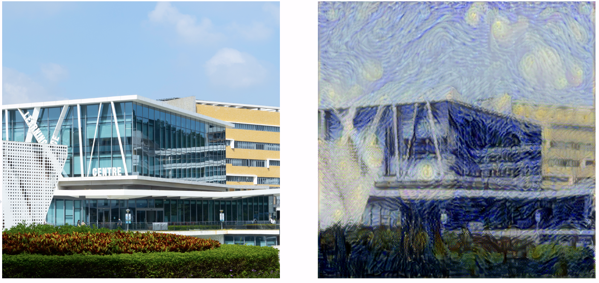
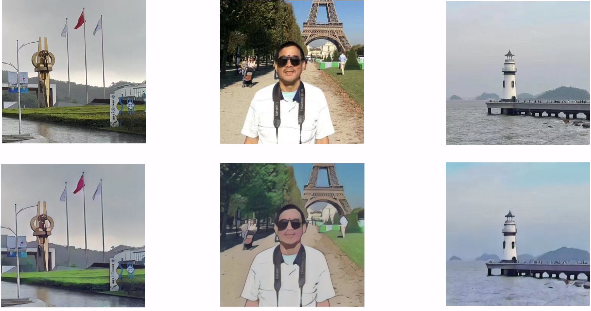

# Image Style Transfer Using CycleGAN

## Introduction

Recently, the trend of employing artificial intelligence for image style transformation has gained significant popularity on the Internet and TikTok, showcasing impressive performance and widespread engagement. This technology enables users to apply a specific style to their content. Some applications include:
- Generating AI Profiles
- Generating Game and Map
- Image Translation

  
In Assignment4b, we experimented with style transfer using VGG19 and a simple cost function. However, the results were unsatisfactory, especially when overfitting occurred, leading to images that closely resembled the training data. This project aims to improve the performance of image style transformation.

  

## Related Work

In the previous assignment 4b, we learned a method for image style transfer derived from the paper "Image Style Transfer Using Convolutional Neural Networks". This method utilizes intermediate layer features in pre-trained convolutional neural networks to represent the content and style of images.

### Content Feature Acquisition
- Select one or more layers in a convolutional neural network, typically deeper layers.
- The outputs of these layers are considered as content features of the image.

### Style Feature Acquisition
- Select multiple layers in a convolutional neural network, typically shallow and middle layers.
- The outputs of these layers are considered as stylistic features of the image.

### Image Representation
- For each image, a collection of feature maps is formed by extracting content and style features at different levels of the network.

### Optimization Process
- The pixel values of the generated image are adjusted to match the given content and style images in terms of content and style features.
- This is achieved by minimizing the loss function, which includes content loss and style loss.

### Drawbacks
1. High computational cost.
2. Single style: This method can only handle a single style image.
3. Constrained by the resolution of the synthesized image.
4. Highly affected by noise.
5. The separation of image content and style is not necessarily a clearly defined issue.

## GAN: What, Why, How

After studying the shortcomings of the algorithm in assignment4b, we discovered an advanced machine learning model called "GAN" (Generative Adversarial Networks). GAN is a computer learning model based on game theory, mainly used in image processing and generative programming.

### Advantages of GAN
- Able to generate data that is very similar to real data.
- Does not require labeled data, reducing training difficulty and cost.

### Working Principle of GAN
- **Generator**: Learns the features of the training set data and tries to generate realistic but non-existent images.
- **Discriminator**: Determines whether an image is "real" or not. The generator and discriminator form an adversarial process and gradually become stronger.

## CycleGAN

### Loss Functions
- **Adversarial Loss**: Ensures the generated images are statistically difficult to distinguish from real images.
- **Cyclic Consistency Loss**: Ensures the image conversion performed by the generator is reversible.
- **Identity Loss**: Minimizes the difference between the generated image and the input image, maintaining identity information.

### Architecture
- **Single GAN**: Consists of an Image Domain X and Y, Generator G, and Discriminator DY.
- **CycleGAN**: Consists of Image Domain X and Y, Generator G and F, Discriminator DY and DX. It preserves more information by ensuring cyclic consistency.

## Experiment

Since the model requires a lot of computing resources, we run this code on Colab. The code of CycleGAN is open source, and we built our work on their code.

## Summary

Our current model still faces some challenges that limit its performance and generalization:
1. The model can only train one style of content using one specific dataset.
2. The model is sometimes unstable and produces poor results, especially when there is noise in the input data.
3. The quality of the output image is not satisfactory.

To overcome these limitations, we could explore techniques like transfer learning and improve the robustness and reliability of our model. We hope to continue our work in the future and achieve better results with our generative model.

## References

- Zhu, Jun-Yan, et al. "Unpaired image-to-image translation using cycle-consistent adversarial networks." Proceedings of the IEEE international conference on computer vision. 2017.
- Gatys, Leon A., Alexander S. Ecker, and Matthias Bethge. "A neural algorithm of artistic style." arXiv preprint arXiv:1508.06576 (2015).
